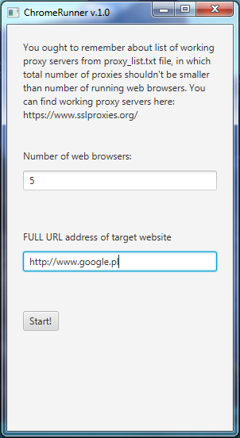

# ChromeRunner
Software which runs multiple instances of Google Chrome each with different IP address. It can be used to test log in system against attacks which use many IP addresses.

### Screenshot:

### General information:
* proxy_list.txt file and chromedriver.exe should be in this same directory as ChromeRunner.jar
* to run this software you have to have installed Java (7 or later) on your computer

### Known issues:
* chromedriver.exe keeps running after closing Chrome tab run by ChromeRunner.jar
